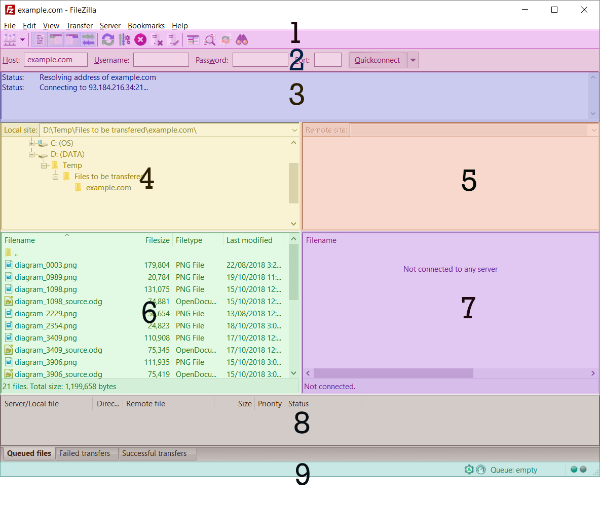

# Setting up FileZilla


**Modifying the server files is irreversible, be careful with your mouse**


## Setup Steps



## Create Folder

Create a folder on your computer where you would like to store some of the servers files (downloading is a choice, but it's still got to setup the folder)



## Install

You can download filezilla from the link bellow or search up `filezilla free` [https://filezilla-project.org/download.php?type=client](https://filezilla-project.org/download.php?type=client) Proceed with the normal software installing steps



### Creating Site

head to [the apex ftp dashboard](https://panel.apexminecrafthosting.com/ftpClient/login/2487531) to get your ftp login info back in filezilla, go to file -> Site manager (ctrl + s) and create a new site, then input the ftp login information. Then head over to the advanced tab. For local directory press browse and find the folder you created. for Default remote add `/default` synchronised browsing is an optional setting to match folders on both your computer and the server. Lastly press `connect`&#x20;

<figure><figcaption></figcaption></figure>



## Panels explained

panels on the left are your client/computer files panels on the right are the server/remote files.

**Panel 1** is the **toolbar**. Which you can use to turn on and off the other panels\
**Panel 3** is the **logs/status** (errors will be displayed here) \
**Panels 4 & 5** are used for displaying **folders** (can help you navigate faster) \
**Panels 6 & 7** are the **main window** where you can access files and folders \
**Panel 8** shows the status and current progress of the **queue**/transfure

<figure><figcaption></figcaption></figure>


These panals can be hidden/shown via the buttons in panel 1.

Double clicking enters folders and right clicking gives you options

It may also be usefull to use software like visual studio code to view/edit files



**Modifying the server files is irreversible, be careful with your mouse**


