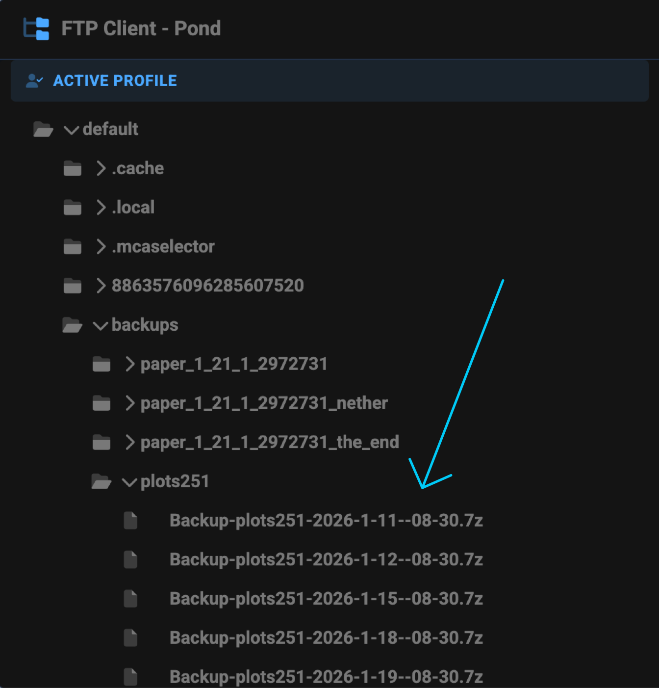
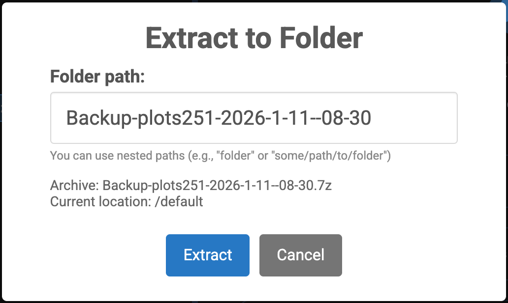
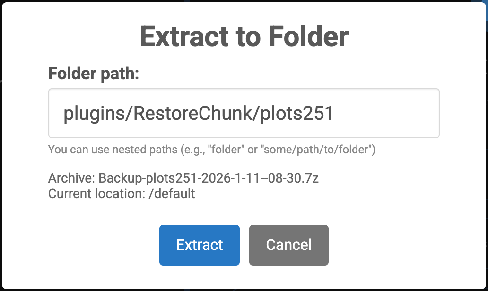
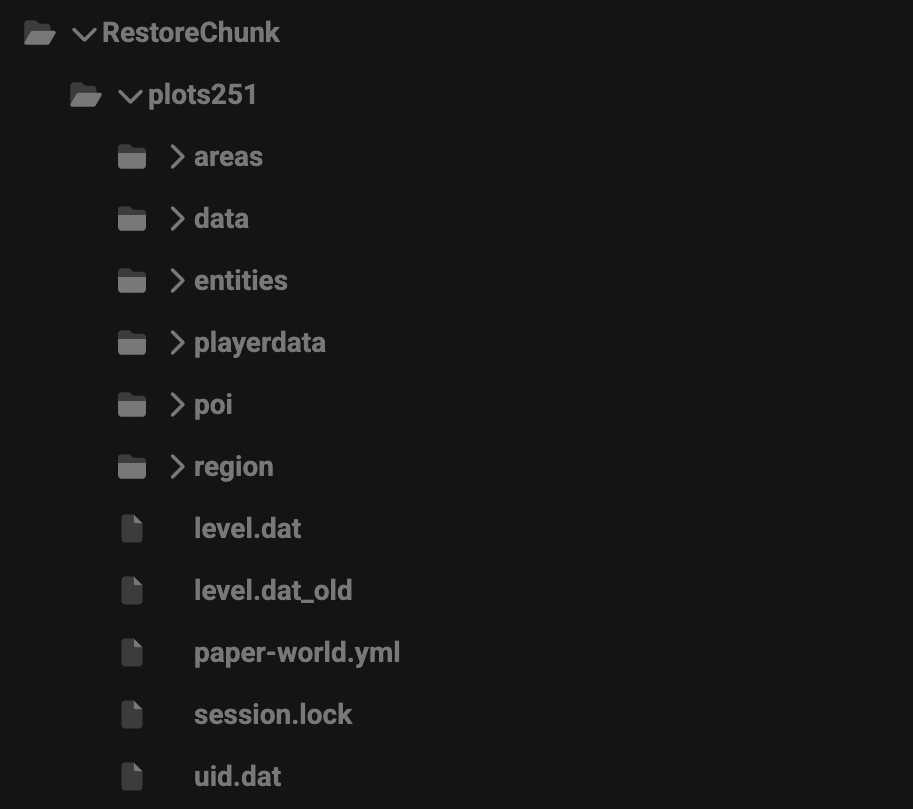
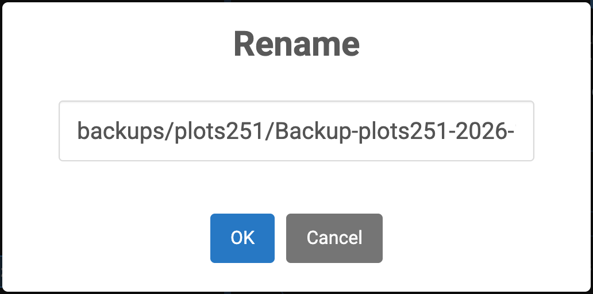

# Restore Chunk

The following is taken from the [Github README](https://github.com/Warriorrrr/RestoreChunk/)

&#x20;<a href="restore-chunk.md#how-to-restore-a-chunk" class="button primary" data-icon="forward">Skip to guide</a>

### Usage

The main command used by the plugin is /restorechunk. To start, you first need to place the region file you want to restore from in the `/plugins/RestoreChunk/$world$/region` directory. You will then be able to use the command to restore the current chunk you're standing in.

#### Custom arguments

Custom arguments can be used with the restorechunk command to fine tune which blocks get restored.

**`i:`/`include:`**

Limits restored blocks to the given blocks.

Example: `/restorechunk include:dirt,stone` will only restore any missing dirt or stone in the chunk.

**`p:`/`predicate:`**

Allows you to use the blocks x, y, or z coordinate as a factor for whether it gets restored or not.

Example: `/restorechunk p:y>70` will only restore blocks above y level 70.

| Operator | Description           |
| -------- | --------------------- |
| >        | Greater than          |
| <        | Lesser than           |
| >=       | Greater than or equal |
| <=       | Lesser than or equal  |
| =        | Equals                |
| %        | Remainder (true if 0) |
| &        | Bit mask (true if 0)  |

**`#preview`**

Allows you to preview the changes without altering the world. You can use `/restorechunk apply` to apply the changes you're previewing. There is currently no way to cancel a preview, other than walking away until the chunk is out of view distance.

**`#relight`**

Relights all adjacent chunks, useful if there are lightning issues at the chunk edge.

### Permissions

There is currently only the `restorechunk.command.restorechunk` permission, used for the main command and given to operators by default.

## How to restore a chunk

This will show you how to restore a chunk from a backup that is in a zip format.



### Prep: Clear old data

We must first check that the restore chunk folder is clear so we can restore the new stuff. The folder is located at `/default/plugins/RestoreChunk`  &#x20;

<figure><figcaption></figcaption></figure>




### Move zip into the default folder

Locate the backup zip file that you may need in `/default/backups/{world}/` and drag it into the default folder. We do this so we can easily move/extract it to subfolders of default

<figure><figcaption></figcaption></figure> <figure><figcaption></figcaption></figure>




### Extract into RestoreChunkk folder

<figure><figcaption></figcaption></figure> <figure><figcaption></figcaption></figure>

Right-click on the zip -> click `Extract to folder` . Then replace the default folder path with `plugins/RestoreChunk/{world}` .The RestoreChunk folder should appear siliar to bellow

<figure><figcaption></figcaption></figure>



### Move Zip Back

Move the zip back to it's origonal folder, this can be done by right clicking -> `Rename` then changing it to `backups/{world}/{name}` &#x20;

<figure><figcaption></figcaption></figure>



### Restore the chunk

On the server, locate the chunk you wish to restore (f3 + g to view chunk borders) and run `/restorechunk` You should see it correctly restored.

<figure><figcaption></figcaption></figure> <figure><figcaption></figcaption></figure>




### Reset RestoreChunk Folder

Clear the folder, like in step 1


