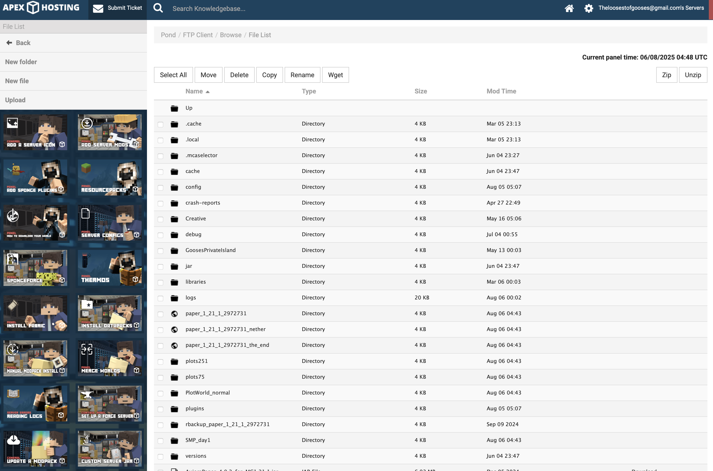
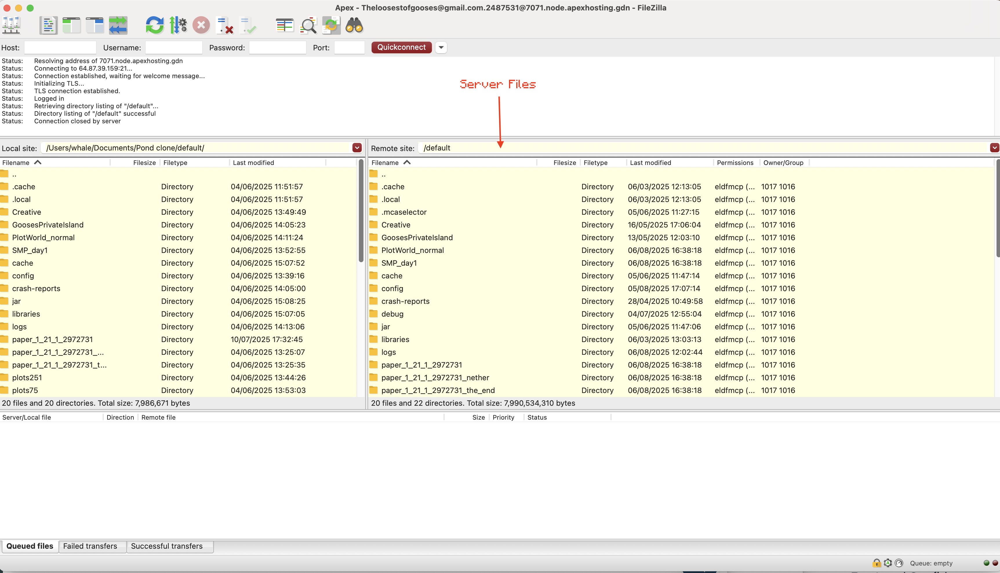
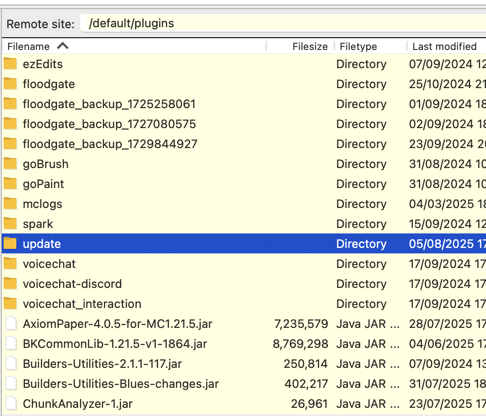
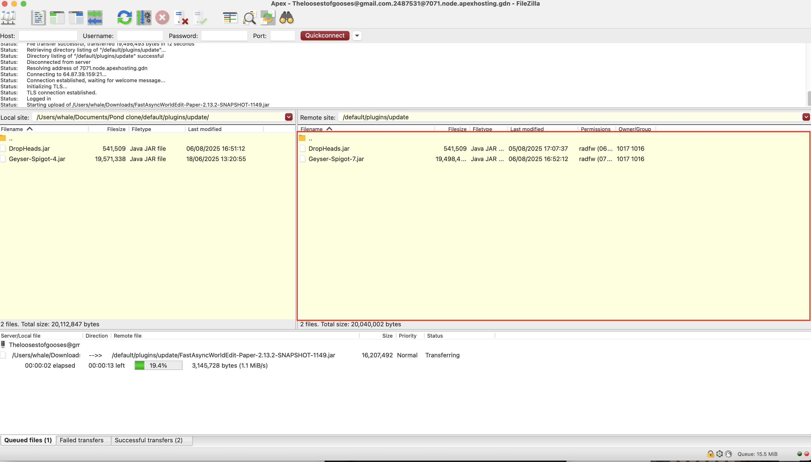

# Updating Plugins in General

### Updating steps



### Download Jar file

Most plugins you can find on Modrinth or just by searching them up. Make sure to get the **paper version** if available. For those that have access to the [pond sheets](https://docs.google.com/spreadsheets/d/1RAVtTbTT8_WFFZVFMBG1g7GngSep1gQhg9ygU5Az1rU), you can find notes and more direct urls there.

Here are a few with specific websites: \
[ViaVersion & ViaBackwards](https://viaversion.com) \
[Geyser](https://geysermc.org/download) \
[FAWE Dev builds](https://ci.athion.net/job/FastAsyncWorldEdit/)&#x20;

Paid plugins require Wordle or Me


**Artafacts/assets**: usually contains the plugin file \
**Dependencies**: Some plugins require you to update other plugins that they rely on




### Open FTP Client

I recommend using FileZilla ([..](../ "mention")), but it's available at the website: [https://panel.apexminecrafthosting.com/ftpClient/login/2487531](https://panel.apexminecrafthosting.com/ftpClient/login/2487531)

(left apex website, right filezilla)

<figure><figcaption></figcaption></figure> <figure><figcaption></figcaption></figure>




### Locate Update Folder

Head to the folder `plugins` -> `update` (not `Updater`)

<figure><figcaption></figcaption></figure>




### Upload the Jar

Drag and drop the jar file into the update folder on the server side

<figure><figcaption></figcaption></figure>



### Restart

You can ether restart the server on the console, /restart or wait till daily restart



