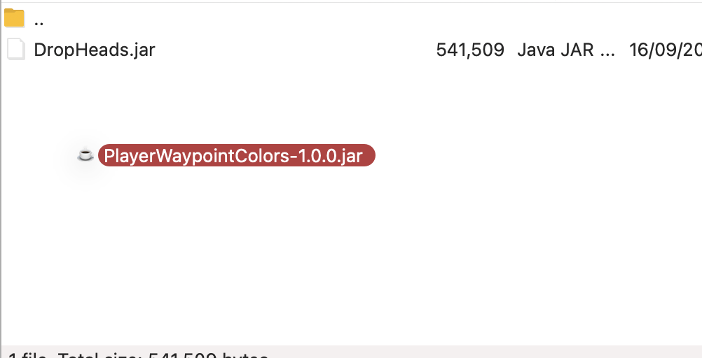
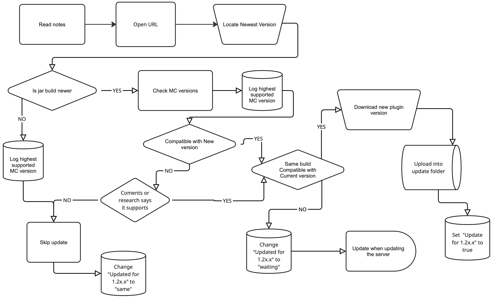

# Updating plugins

We keep a record of many of the plugins (A few unimportant ones may be missing) on this [google sheet](https://docs.google.com/spreadsheets/d/1RAVtTbTT8_WFFZVFMBG1g7GngSep1gQhg9ygU5Az1rU/edit?gid=1065632537#gid=1065632537), this is what we will be using. Msg another mod if you need access



## Collums explaned

#### Plugin

Name of the plugin (May be some jiberish numbers you can ignore)

#### Last Updated

We don't really use

#### Importance

The importance is measured from 1-5 stars. Many have not been done, feel free to add your own rating. **Do not update the server if a 4+ star plugin is incompatible**

#### Updated for 1.2x.x

This tracks the progress during the update. Checked means that it has been installed on the server. "Same" means that there was new version of the plugin. "Waiting" means that it must be installed at the same time we update the server. e.g. Axiom has a different plugin for each server version, so the 1.21.8 version won't work on 1.21.5.

#### Build

This is the build/version of the plugin currently installed on the server

#### Supported versions

This is newest Minecraft version that the newest version of the **plugin can support** (Not necessarily the installed version).

#### Dependances

The plugin in this row relies on the plugin in this cell. You may need to update both

#### URL

A link to the mod. Different websites have different layouts, key things to look out for are: build version, Minecraft version, dates, paper, artefact, comments.

#### Notes

notes...

## Updating onto the server

To update a plugin, open filezilla ([..](../ "mention") if you need help) and locate the update folder `default -> plugins -> update` (It is the one in **all lowercase**)

Drag and drop files into the remote/server update folder

<figure><figcaption></figcaption></figure>

## Putting it all together

During the update process go through each plugin and check. Feel free to allocate this to other people or write a comment on one you're confused with

This flow chart explains the process for each plugin




Many plugins do still support versions newer than what they state, comments, a quick google search or joining their discord server can be helpfull. If it is a 3+ star plugin, I recommend brining it up so we can look into it.


Image if embed doesn't work

<figure><figcaption></figcaption></figure>
