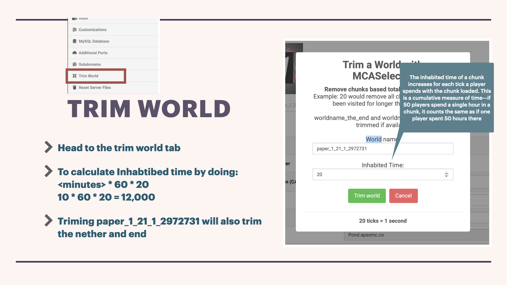

# World Trimming

Think carefully about weather trimming is wanted or needed. Trimming is useful to allow new terrain to generate in unpopular areas and to save a little bit of storage. Keep in mind, you'll likely have to to pre-generate terrain again afterwards.


make sure to backup before proceding


On the apex website head to the `trim world` tab (you must be administrator to use this). Then input the world name (default is often right) and the amount of inhabited time ticks you want to trim.

<figure><figcaption></figcaption></figure>


you can not trim nether or end by itself



The inhabited time of a chunk increases for each tick a player spends with the chunk loaded. This is a cumulative measure of time—if 50 players spend a single hour in a chunk, it counts the same as if one player spent 50 hours there


The equation for minuets to ticks is `<minutes> * 60 * 20`. Between 5-10 minutes is usually a good amount of time

If you need a visualisation use [MCA Selector](https://www.google.com/url?sa=t\&source=web\&rct=j\&opi=89978449\&url=https://github.com/Querz/mcaselector\&ved=2ahUKEwjT2-XkrI6QAxVj6jgGHWrSMqcQFnoECAwQAQ\&usg=AOvVaw1Nz6TmRQRAiNhXhggFABcJ). Basic [Tutorial](https://www.youtube.com/watch?v=d7eoz5GXSlM). (Don't actually use it to trim)
